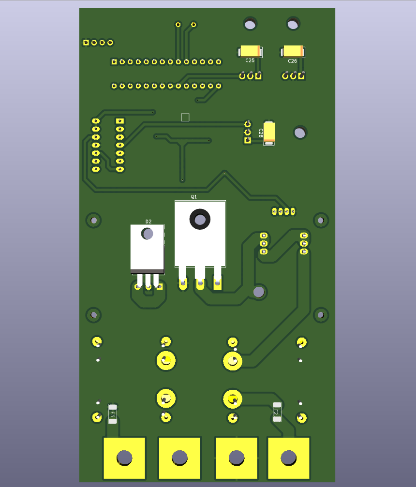
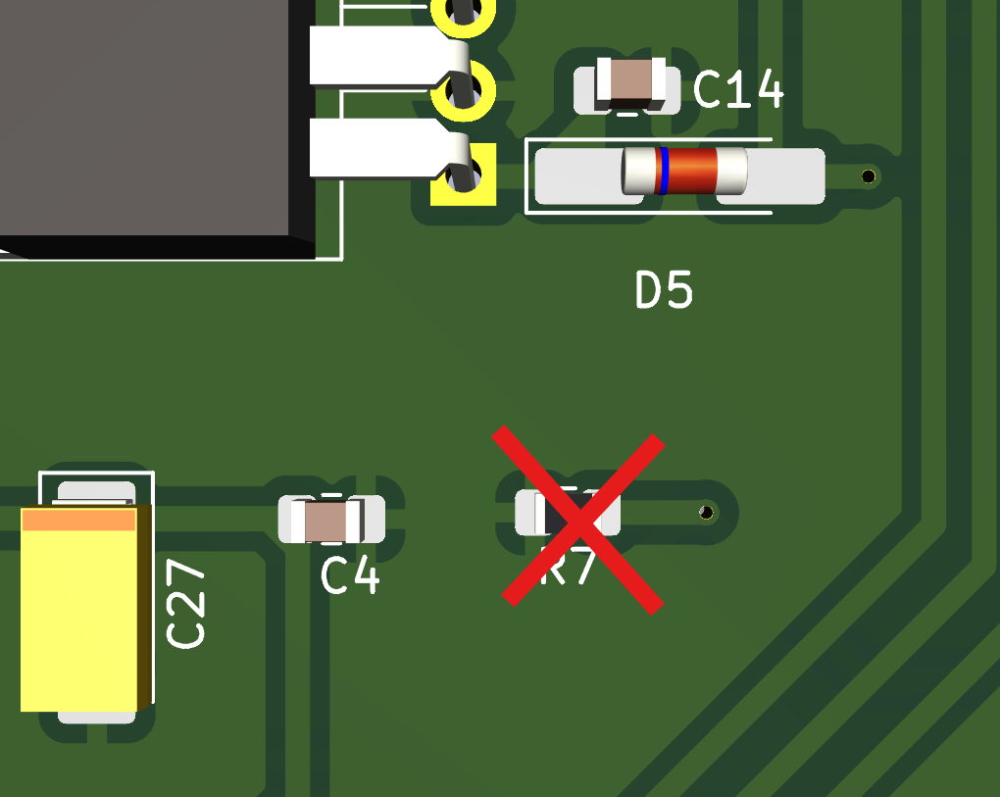

# MCC25
MCC25  
MPPT Battery charger  

| Input Voltage     | 0 ~ 21 V  |
| ----------------: | :-------- |
|   Output Voltage  | 21 ~ 40V  |
| Output Power      | 200 W     |
| Efficiency        | > 90%     |

## Modelo 3D

  
  

## Placa Soldada

  
  
  

# Guia de montagem da placa MCC25

A placa foi projetada para facilitar a montagem, mas é necessário tomar alguns cuidados devido a algumas alterações no projeto.

## Passo a Passo

| Passo | Instruções | Imagem |
|------|------------|--------|
| **1** | Realizar a troca do resistor R20 de 15Ω para um resistor de 4.7Ω. |  |
| **2** | Isolar o pino de referência do sensor de efeito HALL "U2" raspando as trilhas conectadas ao GND, em ambos os lados da placa. |  |
| **3** | Não realizar a solda do resistor R7, pois ele será soldado em outro local da placa. |  |
| **4** | Após isolar o pino de referência do sensor de efeito HALL, realizar a solda dele normalmente. Em seguida, soldar um resistor de 150Ω entre o pino de referência e o output do sensor. (Certificar-se de que não há curto-circuito). |  |
| **5** | Montagem do snubber: verificar a necessidade, mas a dica de montagem é usar um diodo TVS Schottky 100V, capacitor de 4.7nF 100V e resistor 4.7KΩ 3W. |  |

## Testes

Em processo...
